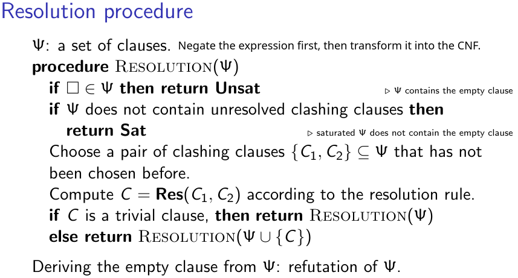
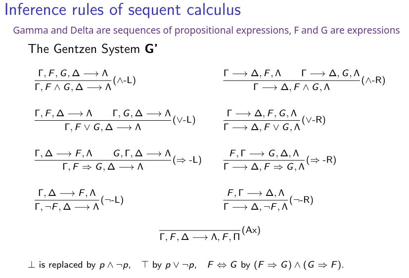
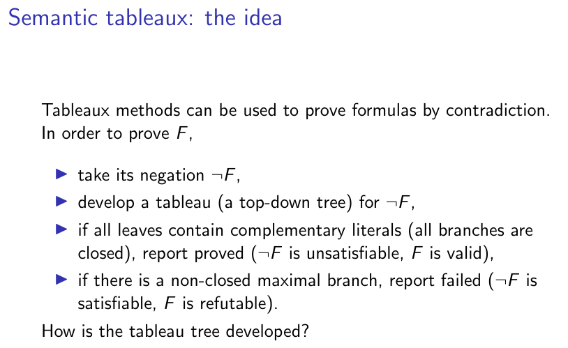
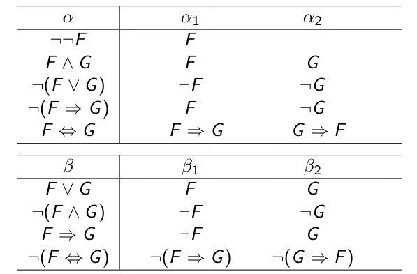
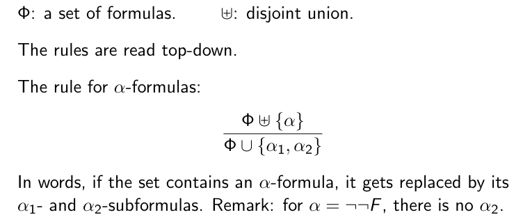
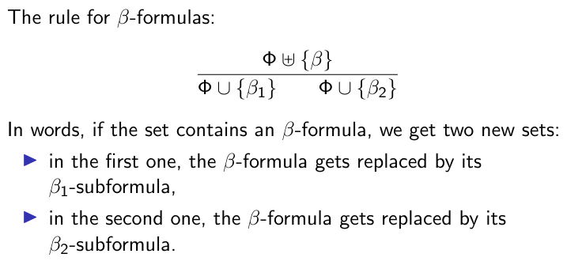
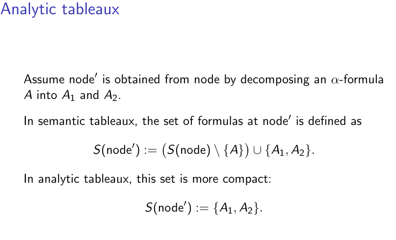
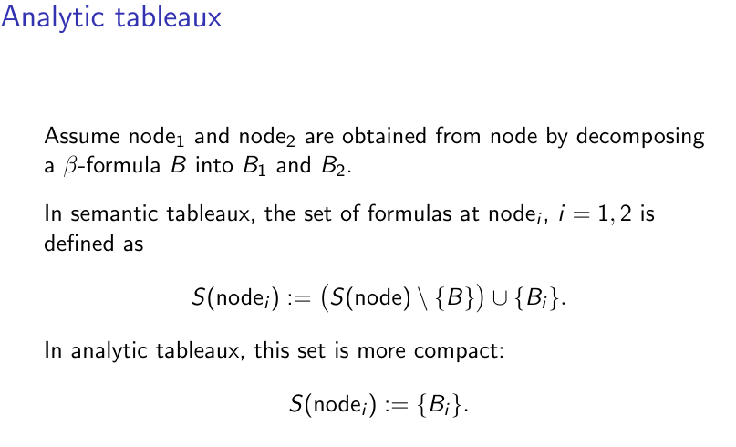

# 🐫 Caml-culus of Logic

[](https://ocaml.org/releases/ocaml-5.3.html)

Implementation of selected concepts from propositional logic, first-order logic, logic programming, probabilistic logic programming, and fuzzy logic programming. 

### Definitions and AUX Modules

The file `definitions.ml` contains the foundational type definitions and auxiliary functions utilized by subsequent implementations. This module serves as the core dependency for multiple files. The files under `aux/` folder are a collection of auxiliary functions for their respective modules (for example, `aux/aux_propositional.ml` contains auxiliary functions for propositional logic).

## Propositional Logic

### Normal Forms

The module `propositional/nf.ml` implements recursive transformation algorithms for propositional logic expressions. It provides methods to convert expressions into three canonical forms: Negative Normal Form (NNF), Conjunctive Normal Form (CNF) and Disjunctive Normal Form (DNF).

### Proof Procedures

`propositional/` folder also implements the following proof methods and some of the auxiliary functions for each method:
1. Resolution 


2. Sequent Calculus


3. Tableaux (Semantic and Analytic)












### Executing the Tests

The tests are generated by DeepSeek V3. Run from the root directory:

```
ocamlc -I aux -I propositional -o tests definitions.ml aux/aux_propositional.ml examples.ml propositional/nf.ml propositional/resolution_propositional.ml propositional/sequent_calculus_propositional.ml propositional/tableaux_propositional.ml tests.ml
./tests
```
OR
```
ocamlc -c definitions.ml
ocamlc -c -I aux aux/aux_propositional.ml
ocamlc -c examples.ml
ocamlc -c -I aux -I propositional propositional/nf.ml
ocamlc -c -I aux -I propositional propositional/resolution_propositional.ml
ocamlc -c -I aux -I propositional propositional/sequent_calculus_propositional.ml
ocamlc -c -I aux -I propositional propositional/tableaux_propositional.ml
ocamlc -c -I aux -I propositional tests.ml
ocamlc -I aux -I propositional -o tests definitions.cmo aux_propositional.cmo examples.cmo nf.cmo resolution_propositional.cmo sequent_calculus_propositional.cmo tableaux_propositional.cmo tests.cmo
./tests
```
