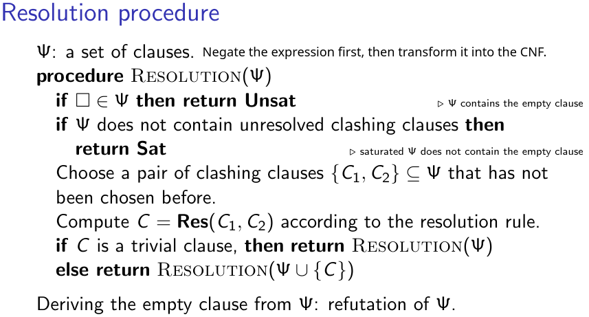

# 🐫 Caml-culus of Logic

[](https://ocaml.org/releases/ocaml-5.3.html)

Implementation of selected concepts from propositional logic, first-order logic, logic programming, probabilistic logic programming, and fuzzy logic programming. 

### Definitions and AUX Modules

The file `definitions.ml` contains the foundational type definitions and auxiliary functions utilized by subsequent implementations. This module serves as the core dependency for multiple files. The files with prefix `aux_` are a collection of auxiliary functions for their respective modules (for example, `aux_propositional.ml` contains auxiliary functions for propositional logic).


## Propositional Logic

### Normal Forms

The module `nf.ml` implements recursive transformation algorithms for propositional logic expressions. It provides methods to convert expressions into three canonical forms: Negative Normal Form (NNF), Conjunctive Normal Form (CNF) and Disjunctive Normal Form (DNF).

### Proof Procedures

`proof_procedures_propositional.ml` implements the following proof methods and some of the auxiliary functions for each method:
1. Resolution 


2. Sequent Calculus (not yet implemented)

3. Tableaux (not yet implemented)

### Executing the Tests

The tests are generated by DeepSeek V3.

```
ocamlc -c definitions.ml
ocamlc -c aux_propositional.ml
ocamlc -c examples.ml
ocamlc -c nf.ml
ocamlc -c proof_procedures_propositional.ml
ocamlc -c tests.ml
ocamlc -o tests definitions.cmo aux_propositional.cmo examples.cmo nf.cmo proof_procedures_propositional.cmo tests.cmo
./tests
```
or
```
ocamlc -o tests definitions.ml aux_propositional.ml examples.ml nf.ml proof_procedures_propositional.ml tests.ml
./tests
```
